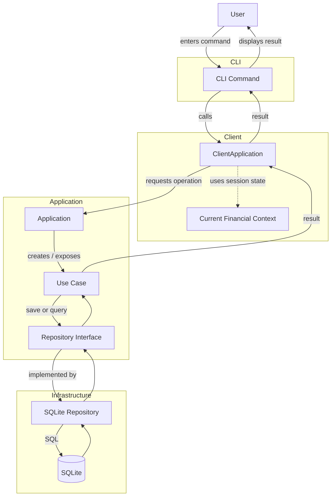

# Current Implementation

Version `0.1` is a local Java prototype of the financial application.

The application currently runs as a single process and is interacted with through a command-line interface. The code already separates client-side interaction, application logic, and persistence, even though there is no real client/server communication yet.

The main goal of the current implementation is to establish the application's architectural boundaries while supporting basic financial-context and account operations.

---

## Package Overview

The main source code is under:

```text
src/main/java/com/rgoncalo/financialapp/
```

The project is organized into the following main packages:

```text
com.rgoncalo.financialapp
├── application
├── cli
├── client
├── commondata
├── infrastructure
└── utils
```

### `commondata`

Contains the common data for the client and server apps.

---

### `application`

Contains the application's use cases and persistence contracts.

This layer coordinates operations such as:

* creating financial contexts;
* retrieving financial contexts;
* creating accounts;
* listing accounts.

It depends on repository interfaces rather than on a specific database implementation.

The `Application` class acts as the main entry point to these use cases.

---

### `client`

Represents the client-side application logic.

It sits between the CLI and the application layer.

The client is responsible for maintaining state that belongs to the current user session, particularly the currently loaded financial context.

For example:

```text
User loads Financial Context A
        ↓
ClientApplication stores Context A
        ↓
Subsequent account operations use Context A automatically
```

The client and application layers currently communicate through direct Java method calls. There is no network boundary in version `0.1`.

---

### `cli`

Contains the command-line user interface.

The CLI is responsible for:

* reading user commands;
* collecting command arguments;
* calling `ClientApplication`;
* displaying results.

There are currently two main CLI contexts:

```text
UserContextCli
    ↓ load financial context
FinancialCli
```

The first handles operations related to selecting and managing financial contexts.

Once a context is loaded, the financial CLI provides operations that apply to that context, such as account creation and account listing.

---

### `infrastructure`

Contains concrete implementations of external concerns.

Persistence is currently implemented using SQLite.

Repository interfaces defined by the application layer are implemented here, keeping database-specific code outside the application logic.

The normal runtime configuration is therefore approximately:

```text
Application Use Case
        ↓
Repository Interface
        ↓
SQLite Repository
        ↓
SQLite Database
```

An in-memory account repository also exists as an alternative implementation.

---

## Application Startup

`Main` acts as the composition root.

At startup it connects the major parts of the application:

```text
SQLite
   ↓
Repository implementations
   ↓
Application
   ↓
ClientApplication
   ↓
CLI
```

This is where concrete infrastructure dependencies are selected.

The application and domain layers therefore do not need to decide which database implementation is being used.

---

## Request Flow

A normal user request starts in the CLI and travels through the client and application layers before reaching persistence.



For example, account creation follows this general path:

```text
User
 ↓
Financial CLI
 ↓
ClientApplication
 ↓
currently loaded Financial Context
 ↓
Create Account use case
 ↓
AccountRepository
 ↓
SQLite
```

The CLI therefore does not interact directly with repositories or the database.

Likewise, application use cases do not depend directly on SQLite.

---

## Current Architectural State

The current implementation can be summarized as:

```text
CLI
 ↓
Client
 ↓
Application
 ↓
Repository Interfaces
 ↓
Infrastructure
 ↓
SQLite
```

---

## Current Limitations

* client and application layers run inside the same Java process;
* monetary values exist, but currency/unit behavior is not yet implemented;
