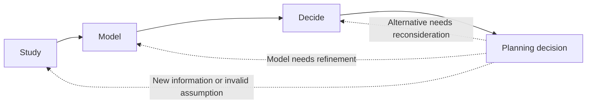
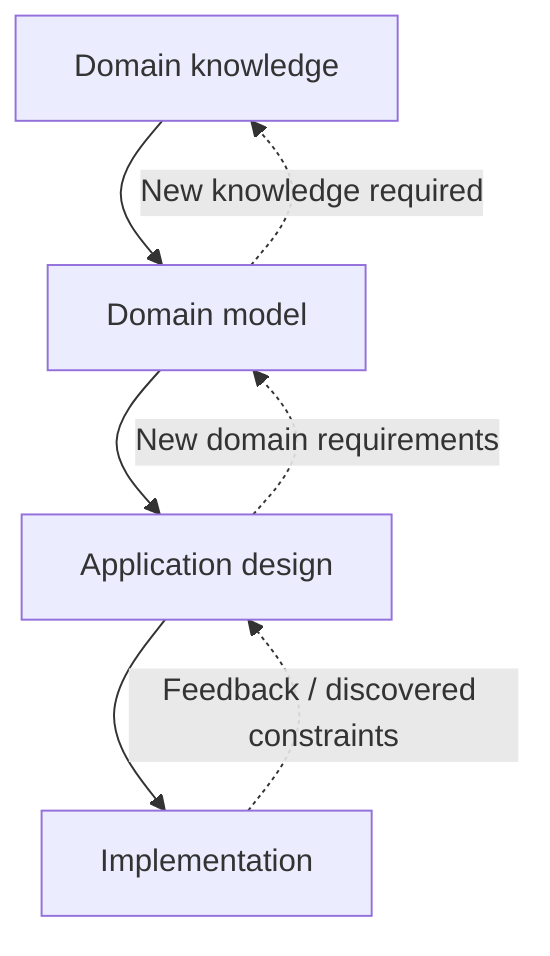
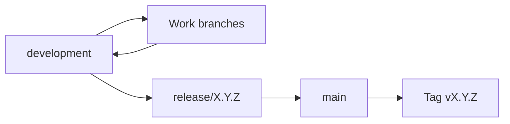

In this document we specify the developing process of the app.

# Document rules

Design documents follow the snake_case.

Several different designs or information may have decoupled versioning. For example, `architecture.md` may have its unique versions for different architectures, named `Architecture version X`. When a design component uses another, its versions should show what are the used versions. For example, in the case of the app using architecture: `App version Y (Architecture version X)`.

# Development methodology

We'll follow the DevOps lifecycle:
- Plan
- Code
- Build
- Test
- Release
- Deploy
- Operate
- Monitor

The main component of DevOps is continuous integration and continuous deployment.

## Planning

Planning consists on deciding on new directions and updating the relevant design files, expressing the intent of what is meant to be built.

Planning follows:



### Study

Before introducing a new concept, relevant domain knowledge, existing
applications and technical constraints are studied when appropriate.

Examples include:
- studying existing money-management applications;
- studying taxation systems;
- studying financial mathematics;
- studying persistence or architectural alternatives.

### Model

The results of the study are translated into concepts in the domain model.

The model should represent the problem rather than the implementation.

For example, an `Account` is a financial concept and should not initially be
defined in terms of a database table or REST resource.

### Decide

When multiple reasonable alternatives exist, a design decision is made and,
when sufficiently important, recorded in `decision_log.md`.

Decisions should be revisited when new information invalidates their original
assumptions.

## Coding

Coding consists on doing the relevant code and updating the repository.

Implementation proceeds incrementally, prioritizing the smallest useful
vertical slice of functionality.

The implementation should validate the domain model rather than silently
forcing the domain model to fit an arbitrary implementation.

A feature is considered complete only after the relevant parts of the
following have been considered:

- domain model;
- business logic;
- persistence;
- user interaction;
- validation;
- tests.

For example, registering a transaction should not be considered complete
merely because a `Transaction` class exists. The complete behavior includes
validation, updating the financial state and making the transaction
observable to the user.

## Testing

Testing consists on...

# Design principles

## Domain first

The financial domain is modelled independently of the technologies used to
implement it. The domain model describes what information and behavior the
system needs without initially deciding where the information is stored or
how it is exposed.

## Incremental complexity

The application is developed from a simple usable core toward the more
complex final system.

The initial implementation does not need to expose all the capabilities of
the final design. However, decisions made in the initial implementation
should not unnecessarily prevent those capabilities from being introduced
later.

## Generality

The model should describe concepts in sufficiently general terms to support
personal finances, companies and groups of entities.

Specialized behavior should therefore preferably be represented as a
specialization of a general concept rather than by creating unrelated
implementations for each use case.

## Historical and future correctness

Financial information is time-dependent. The design must therefore account
for both the historical state of finances and their projected future state.


# Design layers

The design is developed in several levels of abstraction.



## Domain knowledge

Domain knowledge describes concepts and rules that exist independently of
the application.

Examples include:
- interest;
- inflation;
- taxes;
- investments;
- loans.

This knowledge is documented separately from the application implementation.

## Domain model

The domain model describes the concepts that the application needs to
represent.

It defines entities such as:
- accounts;
- transactions;
- financial entities;
- assets;
- contexts;
- units;
- values;
- rules.

The domain model should avoid unnecessary assumptions about databases,
network protocols, user interfaces or programming languages.

## Application design

Application design determines how the domain model is exposed and
implemented.

This includes:
- architecture;
- persistence;
- APIs;
- user interface;
- technology choices;
- deployment.

## Implementation

The implementation is derived from the previous layers and is allowed to
introduce implementation-specific concepts where necessary.

# Coding

Code should follow the conventions of the language and frameworks being used,
unless there is a documented reason to deviate from them.

## Naming

For class names, we use *PascalCase*.

For variable, parameter and function names, we use *camelCase*.

For constants, we use *UPPER_SNAKE_CASE*.

Packages use snake_case.

## Packages and modules

Packages and modules should be organized according to the responsibility
of the code.

Domain concepts should be kept separate from infrastructure and interface
concerns where the architecture requires this separation.

# Version control

The repository uses a small number of long-lived branches and short-lived
branches for individual changes.

The long-lived branches are:

* `main`: contains the latest released and stable version of the
  application.
* `development`: contains the integrated state of the next version under
  development.

Work that is not yet ready to be integrated is developed in short-lived
branches created from `development`.

## Commits

Each commit should represent a coherent change.

A commit should preferably:
- have a single purpose;
- leave the project in a consistent state;
- include the relevant design changes when the implementation changes the
  documented design.

Commit messages should briefly describe the change using an imperative form.

## Work branches

Branches are used to isolate work that is not yet ready to be integrated.

Branch names should describe the work being performed rather than the version
in which the work is expected to be released.

Examples:

* `feature/transaction-import`
* `feature/tax-calculation`
* `fix/account-balance`
* `refactor/transaction-model`
* `docs/domain-model`

A work branch is created from `development` and is merged back into
`development` when its work is complete and sufficiently tested.

After merging, the work branch may be deleted. Branch names may be reused for
later work; the branch name does not represent a permanent feature or version.

A large feature may be divided into several work branches when doing so
allows smaller changes to be integrated independently.

## Work branches

Branches are used to isolate work that is not yet ready to be integrated.

Branch names should describe the work being performed rather than the version
in which the work is expected to be released.

Examples:

* `feature/transaction-import`
* `feature/tax-calculation`
* `fix/account-balance`
* `refactor/transaction-model`
* `docs/domain-model`

A work branch is created from `development` and is merged back into
`development` when its work is complete and sufficiently tested.

After merging, the work branch may be deleted. Branch names may be reused for
later work; the branch name does not represent a permanent feature or version.

A large feature may be divided into several work branches when doing so
allows smaller changes to be integrated independently.

## Development branch

`development` represents the current integrated state of the next version.

Changes should normally enter `development` through work branches.

`development` should remain in a buildable and testable state. It may contain
functionality that is not yet part of a released version.

The version being developed is determined by the planned scope and release
process, rather than by the name of the `development` branch.

## Release branches

When the planned functionality for a version has been integrated into
`development`, a release branch is created from `development` for final
stabilization.

Release branches are named according to the version being prepared:

* `release/0.1.0`
* `release/0.2.0`
* `release/1.0.0`

A release branch is used only for changes necessary to prepare that version
for release, such as:

* fixing release-blocking bugs;
* correcting documentation;
* completing release-specific tests;
* making necessary compatibility or packaging changes.

New functionality intended for a later version should not be added to a
release branch.

When the release is ready, the release branch is merged into `main` and the
released commit is tagged with the corresponding version.

For example:

```text
development
    |
    |  release scope complete
    v
release/0.1.0
    |
    |  stabilization
    v
main
    |
    +-- tag: v0.1.0
```

Release branches are temporary. After the release has been completed, the
release branch may be deleted.

## Releases

Releases are represented by Git tags rather than permanent branches.

A release tag identifies the exact commit that was released.

Release tags use the form:

```text
v<major>.<minor>.<patch>
```

For example:

```text
v0.1.0
v0.1.1
v0.2.0
v1.0.0
```

A release should only be tagged after the corresponding release branch has
passed the required tests and the application is considered ready for
deployment.

The release process is therefore:



## Changes to released versions

After a version has been released, changes to that version are normally made
in a new work branch based on the corresponding release branch or release
tag, when maintenance of that version is required.

The resulting fix must also be incorporated into `development` when the fix
is applicable to future versions.

For example:

```text
                  +-- fix/critical-bug --+
                  |                      |
release/0.1.0 ----+                      +--> main
                                         |
development -----------------------------+
```

This prevents a fix applied to an older released version from being lost in
the current development version.

Older release lines are maintained only when there is a reason to support
that version independently. Otherwise, development continues from the latest
state of `development`.

## Version development and design

A version is a product milestone and is not itself a development branch.

The design and implementation of a version may therefore progress through
multiple work branches:

```text
development
    |
    +-- design/domain-model --------+
    |                                |
    +-- feature/accounts ------------+
    |                                |
    +-- feature/transactions -------+--> development
    |                                |
    +-- feature/balance ------------+
                                     |
                                     v
                               release/0.1.0
                                     |
                                     v
                                   main
                                     |
                                  v0.1.0
```

Design, implementation and testing of a feature should normally be kept
together in the work required to complete that feature. Separate branches
should be used when the work can be meaningfully integrated independently.

The branch structure must not be used as a substitute for the design
structure. The design documents define the application's concepts,
requirements and decisions, while Git branches represent temporary units of
development work.
