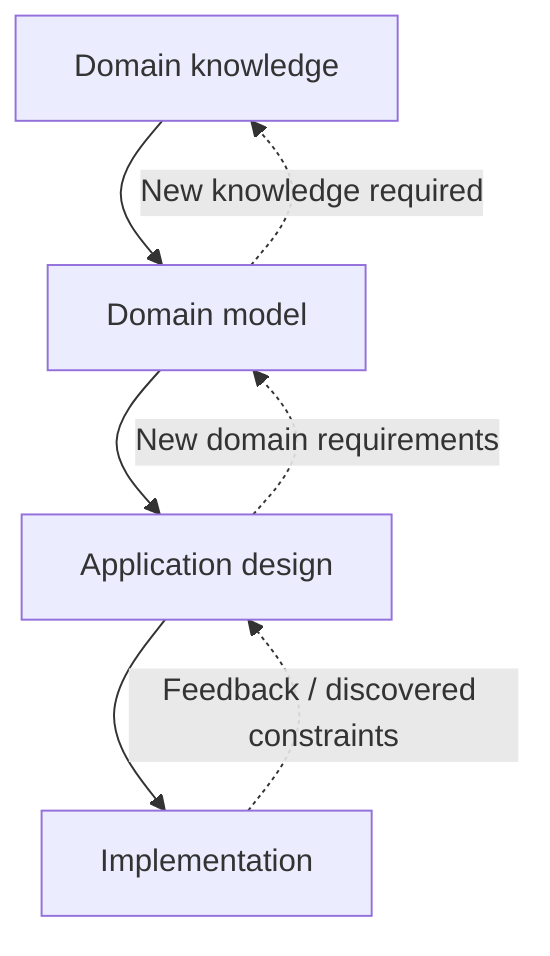

# Design methodology

## Principles

### Domain first

Model the financial domain independently of the technologies used to implement
it. The domain model describes required information and behavior before
deciding where it is stored or how it is exposed.

### Incremental complexity

Develop from a simple usable core toward the more complex final system. An
initial implementation need not expose every future capability, but it should
not unnecessarily prevent later capabilities.

### Generality

Describe concepts generally enough to support personal finances, companies and
groups of entities. Prefer specialization of general concepts over unrelated
implementations for each use case.

### Historical and future correctness

Financial information is time-dependent. Design must account for both
historical state and projected future state.

## Design layers

### Domain knowledge

Domain knowledge records concepts and rules that exist independently of the
application, including interest, inflation, taxes, investments and loans.

### Domain model

The domain model defines the application's financial concepts, such as
accounts, transactions, financial entities, assets, contexts, units, values
and rules. It avoids unnecessary assumptions about databases, network
protocols, user interfaces and programming languages.

### Application design

Application design determines how the domain model is exposed and implemented,
including architecture, persistence, APIs, user interface, technology choices
and deployment.

### Implementation

Implementation derives from the preceding layers and introduces
implementation-specific concepts only where necessary.
