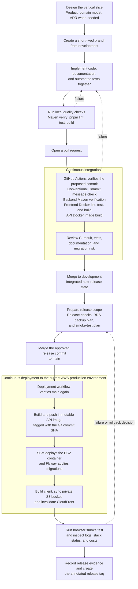

# Project methodology

This is the project's single operating guide. It replaces the former separate
planning, design, coding, build, test, Git, documentation, and release guides
so those rules have one owner and one update path.

## Documentation set

Keep only these Markdown files actively maintained:

| Concern | Source of truth | Update when |
| --- | --- | --- |
| Project entry point, local setup, and delivery summary | ../README.md | the way a contributor starts, verifies, or deploys the project changes |
| Product scope and user journeys | ../design/app_design/product.md | a user goal, workflow, scope boundary, or acceptance criterion changes |
| Current architecture and implemented data | ../design/app_design/architecture.md | a runtime boundary, API/persistence behavior, security boundary, cloud topology, or data invariant changes |
| Long-term domain vocabulary | ../design/app_design/domain_model.md | a future financial concept or business rule is introduced or revised |
| Lasting decisions | ../design/app_design/decision_log.md | a choice has meaningful alternatives, consequences, or assumptions worth preserving |
| Released scope and roadmap | ../design/app_design/version_history.md | a release is made or its planned scope materially changes |
| Backend implementation | ../app/README.md | backend setup, package structure, REST contract overview, or test runtime changes |
| Browser implementation | ../client/README.md | frontend setup, UI architecture, transport, or browser behavior changes |
| Cloud deployment and operations | ../infra/aws/README.md | CloudFormation, deployment, monitoring, backup, recovery, cost, or credential procedure changes |
| This guide | methodology.md | the development process, documentation strategy, checks, or release gates change |

Domain research under ../design/domain_knowledge/ and market research under
../design/market_study/ are reference notes, not routine change documents.
Update them only when new external knowledge changes a product or technical
decision. Do not create a new Markdown file for a normal issue, bug, feature
branch, meeting, or pull request; use the issue and PR instead.

## Documentation update map

Use this matrix before opening a pull request. The documents in **Required**
change with the implementation; the documents in **Consider** change only when
the stated condition is true.

| Change strategy | Required | Consider |
| --- | --- | --- |
| Small bug fix with no contract change | Code and tests; no Markdown by default | Architecture if the bug exposed an incorrect documented invariant; decision log if it reverses an earlier decision |
| UI-only improvement | client README when the UI architecture or local workflow changes | Product when user workflow or acceptance criteria change; architecture when the browser/API contract changes |
| New vertical feature | Product, architecture, code, tests | Domain model for a new concept; decision log for a consequential design choice; version history when committed to a release |
| New financial concept or rule | Domain model, product, code, tests | Domain knowledge if research supports the rule; architecture for persistence/API impacts; decision log for trade-offs |
| API contract change | Architecture, app README, client README, code, tests | Product for user-visible behavior; decision log for versioning, auth, or compatibility strategy |
| Database or Flyway migration | Architecture, code, tests | app README for local setup; AWS README for backup/restore or deployment impact; decision log when the model changes |
| Refactor with unchanged behavior | Code and tests | Architecture only if a boundary or deployment model actually changes; methodology if the new practice is project-wide |
| Authentication or authorization change | Architecture, code, tests | Product for changed user access; decision log for identity/threat choices; AWS README for secret or operational impact |
| Cloud, CI/CD, or observability change | AWS README, architecture, code/configuration, tests | Root README if contributor workflow changes; decision log for cost/security/availability trade-offs; this guide for a changed gate |
| Dependency or tooling update | Code/configuration and tests | README only if prerequisites/commands change; decision log only for a strategic platform change |
| Release preparation | Version history, root README if release command changes | Architecture for changed limitations; AWS README for operation changes; decision log for accepted risk |
| Incident, recovery, or cost issue | AWS README | Architecture if it exposes a design limitation; decision log when the long-term direction changes |

A document can link to another source of truth but must not duplicate its
detailed rules. For example, the root README links to the AWS runbook rather
than restating deployment commands.

## Work lifecycle

## CI/CD delivery flow

CI proves that a proposed source revision satisfies the automated quality
gates. CD begins only after the verified revision reaches `main`: it
re-verifies that commit, deploys the API and client, and then requires a manual
smoke test. There is currently no automatic deployment from `development` to
a separate staging environment.

### 1. Plan a vertical slice

Work from a user-observable outcome. State the goal, rules, acceptance
criteria, affected boundaries, risks, and tests. Research only enough to make a
responsible decision. When an assumption or trade-off will matter later, add an
ADR before or with the code.

Domain knowledge informs the domain model; the model informs product and
architecture; implementation can reveal constraints that feed back into all
three. Avoid modelling a database table or HTTP endpoint before understanding
the financial concept it represents.

### 2. Implement and refactor

Implement the smallest useful end-to-end slice rather than completing one
technical layer in isolation. A financial feature includes validation,
authorization, persistence, user feedback, and tests—not only a data class or
screen.

Refactoring improves design without intentionally changing externally
observable behavior. Keep it focused, preserve or add tests, and make a
separate commit when practical. Prioritise transaction boundaries for
multi-repository writes, an OpenAPI contract to replace duplicate client types,
clear handling of the legacy CLI, and deterministic ID/time abstractions when
they become useful.

Keep educational comments, but make them durable. Explain non-obvious **why**:
an invariant, security boundary, integration constraint, or consequence of a
change. Use Javadoc for public contracts such as nullability, ownership,
ordering, side effects, errors, or units. Do not add a comment that merely
repeats syntax or a well-named line of code.

### 3. Build and test

A build turns a source revision into reproducible artifacts. Lock dependencies,
use Java 21 and Node 22, and never put credentials or environment-specific
production configuration in an artifact.

Run the proportional checks locally and require their CI equivalents before
integration:

    # Backend; Docker is required for PostgreSQL Testcontainers.
    mvn -f app/pom.xml -B -ntp verify

    # Client
    corepack enable
    pnpm --dir client install --frozen-lockfile
    pnpm --dir client lint
    pnpm --dir client test
    pnpm --dir client build

Tests must be deterministic, independent, readable, and written around
business behavior. Financial calculations, validation, authorization,
historical data, migrations, and error paths need explicit boundary cases.
Use the lowest-cost test that provides meaningful confidence, then add
integration or browser smoke tests when a boundary makes unit tests insufficient.

The current deployment rebuilds from the verified Git commit rather than
promoting one CI-built artifact. The API image is traceable through its
immutable commit-SHA ECR tag. A future improvement is to promote verified image
digests and client bundles without rebuilding.

### 4. Use Git and CI/CD deliberately

Use short-lived branches from development and return work through a pull
request. Main is the stable released branch; development is the integrated
next-release branch. Use concise Conventional Commit messages such as:

    feat(client): add transaction filters
    fix(api): reject a transaction with no account
    docs: clarify RDS recovery
    refactor(domain): extract money comparison

Keep commits coherent. Do not mix unrelated formatting churn, generated files,
or feature changes. Install pre-commit hooks with:

    python -m pre_commit install --install-hooks

The hooks catch whitespace, YAML, private keys, large files, and client linting.
They are not a replacement for backend verification, frontend tests, builds,
or deployment smoke tests.

Protect development and main: require CI, disallow force pushes and direct
pushes, and require review when one is available. CI runs for pull requests and
development pushes. A main push reruns verification and starts the serialised
production deployment.

### 5. Release and operate

A release is a product milestone, not a branch that accumulates work. Prepare a
release branch from development when scope is complete; accept only
release-blocking fixes and documentation corrections. After approval, merge to
main and tag the exact commit as vMAJOR.MINOR.PATCH.

Before the first release, collect evidence for every relevant item:

- versioned scope, user-visible changes, known limitations, and support/data
  expectation;
- Maven verification, client lint/test/build, Docker image builds, and reviewed
  CloudFormation changes;
- protected branches, least-privilege deployment identity, secret hygiene,
  MFA, budget alert, and cost anomaly detection;
- RDS snapshot plus a practiced restore procedure;
- a deployed smoke journey: register, login, create context/account/transaction,
  reload, logout, and login again;
- deployed Git SHA, ECR image tag, migration version, stack status, endpoint,
  logs, and smoke-test result; and
- a recovery decision for application rollback, migration failure, and
  CloudFormation failure.

The present environment is a single-instance learning topology. It has no
zero-downtime deployment, shared server-side sessions, end-to-end encrypted API
origin, OIDC deployment identity, origin-specific authentication, WAF, or
automatic rollback. Treat those as prerequisites before storing sensitive
financial data.

## Documentation hygiene

Update documentation in the same branch as the
change it describes. Prefer editing an existing source of truth over adding a
new document. A new Markdown file needs a clear owner, audience, update
trigger, and reason it cannot be a section in one of the documents above.

At release time, mark future intentions as planned and actual behavior as
implemented.
