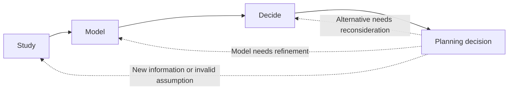

# Planning

Planning expresses what will be built and why before implementation begins.
It is proportional to the change: a small bug fix may need only a short issue
or pull request description, while a new financial concept may need domain
research and a recorded design decision.

## Study

Before introducing a concept, study relevant domain knowledge, existing
applications and technical constraints when appropriate. This can include
money-management applications, taxation systems, financial mathematics,
security requirements, persistence options or cloud deployment constraints.

Record sources and conclusions in the relevant domain-knowledge or market-study
document when they will influence future work.

## Model

Translate the study into concepts, relationships, invariants and examples in
the domain model. Model the problem before choosing its database table, REST
resource or user-interface representation. For example, an `Account` is a
financial concept before it is a persistence record or API response.

## Decide

Compare reasonable alternatives against the current needs and constraints.
Record an important decision in `design/app_design/decision_log.md`, including:

- the decision and its date;
- the context and assumptions;
- alternatives considered;
- consequences and follow-up work.

Revisit a decision when its assumptions are no longer true. A decision log is
not an obstacle to change; it preserves the reason for the previous choice.

## Plan a vertical slice

Turn the chosen direction into the smallest user-observable slice that can
validate it. State the behavior, acceptance criteria, affected design
documents, risks and required tests. Split work further when each part can be
independently integrated without leaving misleading or broken behavior.
